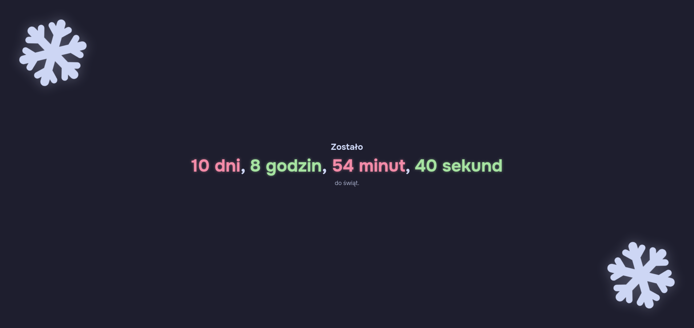

# Odliczanie do świąt

## Podgląd

## Jak uruchomić stronę?
- Wymagania:
  - Node.js
  - NPM

1. Wpisz komendę `npm install` by zainstalować wymagane biblioteki.
2. Wpisz komendę `npm run dev` by uruchomić stronę.